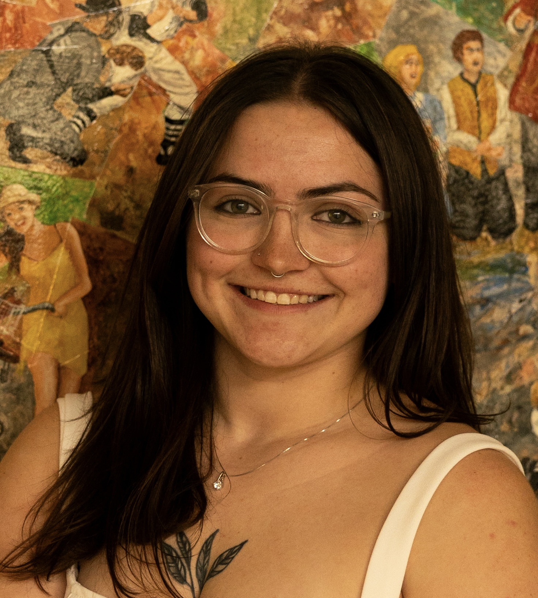

::: {.profile-container}
::: {.profile-image}
{.circle-image}
:::
:::

I am a Ph.D. student in the Department of Statistics at the University of California, Berkeley. I recently completed my M.S. in Applied Mathematics (advised by Drs. Nilanjan Chakraborty and Gayla Olbricht) from Missouri University of Science and Technology, where I also earned my B.S. in Applied Mathematics. 

My current research focuses on benchmarking methodology to detect latent sleep states from fMRI data when EEG data is missing. I am interested in continuing research in the realm of temporal statistics and methodological development, specifically for biological applications. See [Research Interests & Projects](research.qmd) to read more about my ongoing projects.
